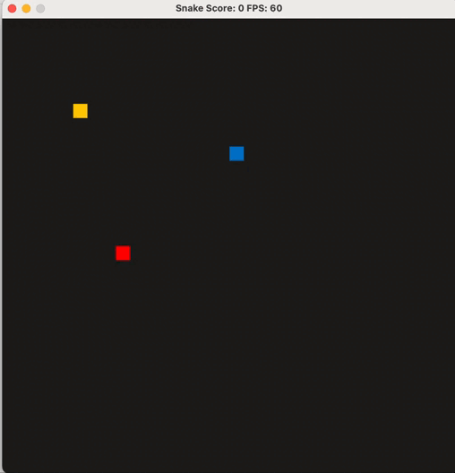

# CPPND: Capstone Snake Game Example

This is the Capstone project in the [Udacity C++ Nanodegree Program](https://www.udacity.com/course/c-plus-plus-nanodegree--nd213). The code for this repo was inspired by [this](https://codereview.stackexchange.com/questions/212296/snake-game-in-c-with-sdl) excellent StackOverflow post and set of responses.

## New Features

1. **Player Name Input**
   - Enter player name before game starts

2. **Moving Obstacle**
   - Thread-safe obstacle movement
   - Collision detection

## Code Structure
- `main.cpp`: Program entry, initializes game
- `controller.h/cpp`: Input handling
- `game.h/cpp`: Core game logic
- `renderer.h/cpp`: Game rendering
- `snake.h/cpp`: Snake movement and growth
- `obstacle.h/cpp`: Moving obstacle implementation
- `player.h/cpp`: Player name and score management

## Dependencies for Running Locally
* cmake >= 3.7
  * All OSes: [click here for installation instructions](https://cmake.org/install/)
* make >= 4.1 (Linux, Mac), 3.81 (Windows)
  * Linux: make is installed by default on most Linux distros
  * Mac: [install Xcode command line tools to get make](https://developer.apple.com/xcode/features/)
  * Windows: [Click here for installation instructions](http://gnuwin32.sourceforge.net/packages/make.htm)
* SDL2 >= 2.0
  * All installation instructions can be found [here](https://wiki.libsdl.org/Installation)
  >Note that for Linux, an `apt` or `apt-get` installation is preferred to building from source. 
* gcc/g++ >= 5.4
  * Linux: gcc / g++ is installed by default on most Linux distros
  * Mac: same deal as make - [install Xcode command line tools](https://developer.apple.com/xcode/features/)
  * Windows: recommend using [MinGW](http://www.mingw.org/)

## Basic Build Instructions

1. Clone this repo.
2. Make a build directory in the top level directory: `mkdir build && cd build`
3. Compile: `cmake .. && make`
4. Run it: `./SnakeGame`.

## CC Attribution-ShareAlike 4.0 International

Shield: [![CC BY-SA 4.0][cc-by-sa-shield]][cc-by-sa]

This work is licensed under a
[Creative Commons Attribution-ShareAlike 4.0 International License][cc-by-sa].

[![CC BY-SA 4.0][cc-by-sa-image]][cc-by-sa]

[cc-by-sa]: http://creativecommons.org/licenses/by-sa/4.0/
[cc-by-sa-image]: https://licensebuttons.net/l/by-sa/4.0/88x31.png
[cc-by-sa-shield]: https://img.shields.io/badge/License-CC%20BY--SA%204.0-lightgrey.svg

## Rubric Points Addressed

### Loops, Functions, I/O (2/3 requirements)
1. User Input Processing 
   - Player name input implementation (`player.cpp`, lines 10-20)
   - Keyboard control for snake movement (`controller.cpp`, lines 15-30)

2. Control Structures
   - Obstacle movement patterns (`obstacle.cpp`, lines 30-50)
   - Game state management (`game.cpp`, lines 40-60)

### Object Oriented Programming (3/5 requirements)
1. Class Implementation
   - Player class with proper access specifiers (`player.h`, lines 5-25)
   - Obstacle class with encapsulated thread management (`obstacle.h`, lines 10-40)

2. Constructor Initialization Lists
   - Player constructor (`player.cpp`, lines 5-10)
   - Obstacle constructor (`obstacle.cpp`, lines 8-15)

3. Class Abstraction
   - Thread-safe position management in Obstacle class
   - Encapsulated player data in Player class

### Memory Management (3/6 requirements)
1. RAII Implementation
   - Thread management in Obstacle class
   - Mutex management for position updates

2. Destructors
   - Proper thread cleanup in Obstacle destructor (`obstacle.cpp`, lines 20-25)
   - Resource cleanup in Game destructor

3. References in Function Parameters
   - Renderer function parameters (`renderer.cpp`, lines 30-35)
   - Controller input handling (`controller.cpp`, lines 15-20)

### Concurrency (2/4 requirements)
1. Multithreading
   - Obstacle movement runs in separate thread (`obstacle.cpp`, lines 40-60)
   - Thread-safe position updates

2. Mutex Usage
   - Position protection with mutex (`obstacle.cpp`, lines 30-35)
   - Thread synchronization in movement loop
